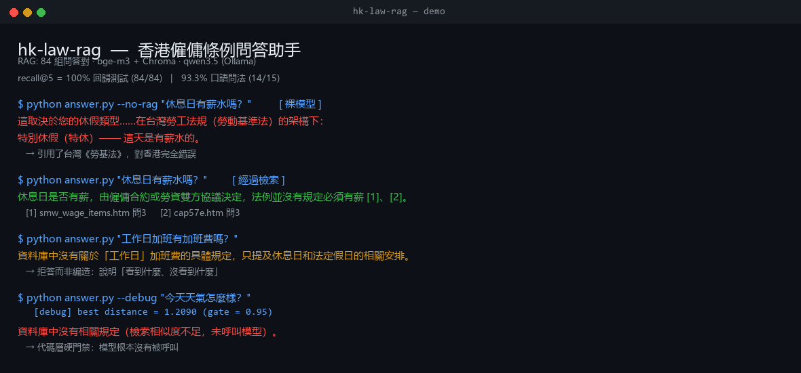

# 香港僱傭條例問答助手 (HK Employment Ordinance RAG)

[](https://github.com/PugtoX/hk-law-rag/actions/workflows/ci.yml)
[](LICENSE)




一個針對香港《僱傭條例》的檢索增強問答系統。用戶用口語提問,系統只根據勞工處官方
FAQ 的條文回答,並標明依據的條文編號;資料庫沒涵蓋的問題會明確拒答,而不是編造。

**動機(實測)**:同一個問題「香港休息日有薪嗎」,直接問模型(無檢索)會得到**錯誤法域**的
答案,而且每次不一樣 —— 三次實測分別給了**中國內地《勞動法》**、模糊表述、以及
**台灣《勞動基準法》**:

| 測試條件 | 裸模型回答 | 對香港 |
|---|---|---|
| 推理模式開啟 | 「休息日是帶薪的…應支付不低於 200% 的工資報酬」 | ❌ 內地《勞動法》 |
| `think:false` | 「取決於用人單位規定及協商結果」 | ⚠️ 碰巧接近 |
| 又一次實測 | 「在台灣勞工法規(勞動基準法)的架構下…特別休假(特休)」 | ❌ 台灣《勞基法》 |

訓練資料裡沒有「香港僱傭條例」這個高頻法域,模型只能從最相近的中文勞動法裡挑,
挑到哪個是隨機的。**法域混淆是法律問答最危險的失敗模式:答案自信、專業、且錯誤。**
本專案用檢索把回答強制約束在香港《僱傭條例》的條文上,消除這種隨機性。

---

## 效果對比

| | 回答 |
|---|---|
| **無 RAG(裸模型)** | 在台灣《勞基法》架構下…特別休假(特休)通常有薪 ← **法域錯誤** |
| **本系統** | 休息日是否有薪,由僱傭合約或勞資雙方協議決定,法例並沒有規定必須有薪 **[1][2]** |
| **資料庫未涵蓋** | 資料庫中沒有關於「工作日」加班費的具體規定,只提及休息日和法定假日的相關安排 |

第三行是幻覺約束生效的例子:模型沒有編造,而是說明「看到什麼、沒看到什麼」。

---

## 架構

```
data/*.htm  (勞工處官方 FAQ, 16 頁)
   │
   ├─ parse_pairs()      按問答對切分  → 84 組結構化問答
   │
   ├─ bge-m3             編碼「問題 + 答案」→ 1024 維向量
   │                     （只編碼答案會漏掉短答案，見〈工程坑〉第 4 條）
   ├─ Chroma             向量庫 + metadata（主題、來源頁、題號）
   │
   ├─ 檢索               top-5，L2 距離
   │
   ├─ 距離門禁           best distance > 0.95 → 直接拒答（不呼叫模型）
   │
   └─ qwen3.5:9b (Ollama) 只依據檢索到的條文生成，強制引用 [1][2]
```

**兩層防幻覺**（不是只靠提示詞）:

1. **代碼層硬門禁** — 檢索距離過大時直接拒答，模型沒有機會編造
2. **提示詞約束** — 只可依據參考條文、必須標註來源、未涵蓋時明說

實測發現兩層缺一不可:「工作日加班費」的 best distance 是 0.70（門禁放行），
但模型正確判斷資料未涵蓋並拒答 —— **若只做代碼門禁，這一題會漏**。

---

## 實測數據

| 指標 | 數值 | 說明 |
|---|---|---|
| 語料 | 16 頁 / **84 組**問答 | 勞工處《僱傭條例》Cap.57 全 14 頁 + 《最低工資條例》Cap.608 2 頁 |
| **回歸測試 recall@5** | **84/84 = 100%** | 用語料原題查自己。**這是「代碼沒壞」的證據，不是能力指標** |
| **口語問法 recall@5** | **14/15 = 93.3%** | 口語化提問查庫。**這才是能對外引用的數字** |
| 距離分佈 | 0.54（命中）／ 0.70（相關但未涵蓋）／ 1.21（完全無關） | 門禁閾值由此定為 0.95 |
| 修復前 recall@5 | 81/84 = 96.4% | 只編碼答案時，3 條短答案檢索不到（見〈工程坑〉第 4 條） |

**口語問法集只有 15 條，樣本偏少**（見〈已知限制〉）。

---

## 快速開始

```bash
# 1) 依賴
python3 -m venv .venv && source .venv/bin/activate
pip install -U pip
pip install -r requirements.txt

# 2) 模型（需先裝好 Ollama）
ollama pull qwen3.5:9b

# 3) 下載語料 + 建索引
python download_data.py      # 16 頁 → data/
python build_index.py        # 84 組 → chroma/

# 4) 問答
python answer.py "休息日有薪水嗎？"
python answer.py --debug "試用期被辭退有賠償嗎？"     # 顯示距離與引用到的條文
python answer.py --no-rag "休息日有薪水嗎？"        # 無檢索對照（會給出內地勞動法答案）

# 5) 檢索品質
python eval_retrieval.py --by-answer     # 回歸測試，預期 84/84
python eval_real_queries.py              # 口語問法，預期 14/15
```

**環境**:WSL2 Ubuntu + RTX 3060 Ti (8GB) + Python 3.14。CPU 亦可運行，只是較慢。

---

## 檔案

| 檔案 | 作用 |
|---|---|
| `download_data.py` | 抓取勞工處 16 頁 FAQ（公開政府資料） |
| `build_index.py` | 解析 → 編碼 → 建 Chroma 索引 |
| `search.py` | 純檢索（不含生成） |
| `answer.py` | 檢索 + 生成 + 引用 + 拒答 |
| `eval_retrieval.py` | 回歸測試（原題查原題） |
| `eval_real_queries.py` | 口語問法基準測試（含答案鍵） |
| `show_pair.py` | 查詢某一組問答，用於核對答案鍵 |
| `samples/verify_*.py` | 各模組的驗證腳本（stub 掉模型與向量庫） |

---

## 工程坑（實際踩過並修復的）

1. **同一頁有兩種 HTML 結構** — 前半頁問題格有「問n.」標記，後半頁沒有（編號只在答案格）。
   按位置切分會切片倒掛，導致 cap57n 只解析出 5/14 對。
2. **目錄區重複編號** — 頁首目錄也含「問1..問n」，任何「記住上一題」的邏輯都會被覆蓋。
   改成以答案列為錨、向上找同號問句。
3. **答案被拆成兩格** — cap57k 的「答2」拆成 `答2(I)` / `答2(II)`，且**無標點**。
   標記正則需接受可選羅馬數字後綴、標點可選，並按題號合併同題答案。
4. **短答案檢索不到** — 「是。」這種 2 字答案單獨編碼幾乎沒有語義信號。
   改為編碼「問題 + 答案」後，recall@5 由 81/84 提升至 84/84。
   （同時 `documents` 仍存純答案，檢索輸出與評測口徑不變）
5. **推理模型吞掉答案** — qwen3.5 開啟思考時，答案會落在 `thinking` 欄位、`response` 為空，
   用戶看到空白。加 `"think": false` 解決，且關閉推理後答案更保守、更貼近條文。
6. **評測標準本身會騙人** — 第一版口語問法集把「同一問題的不同措辭來源」判為 miss，
   得出 66.7% 的假低分。改為「一題多解」（接受任何正確來源）並逐條核對後才是 93.3%。

---

## 已知限制

- **語料邊界**:香港《僱傭條例》**沒有法定加班費規定**（加班費屬合約或行業慣例）。
  系統對此正確拒答，但這也是明確的覆蓋缺口。
- **口語問法集僅 15 條**，統計意義有限；擴充至 40–50 條會更可信。
- **尚未部署**：目前為本機 CLI，沒有對外 URL。
- **不做法律意見**：答案僅供參考，實際爭議以法庭判決為依歸。

---

## 資料來源

香港勞工處公開 FAQ（政府公開資料，個人學習及非商業用途）:
`https://www.labour.gov.hk/tc/faq/cap57{a..n}_whole.htm`
`https://www.labour.gov.hk/tc/faq/smw_{coverage,wage_items}.htm`

## 授權

程式碼採 **MIT License**（見 `LICENSE`）；`data/` 與 `samples/` 的條文內容來自香港勞工處
公開資料，版權屬香港特別行政區政府，使用時請遵循政府網站條款。本專案僅供技術學習，
不構成法律意見。
